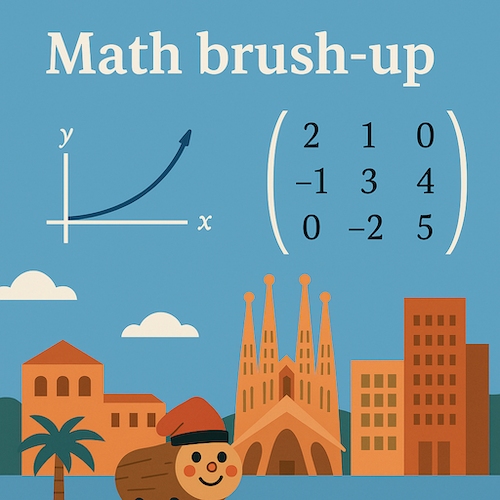

# 19BE02 Calculus and Linear Algebra - Fall 2025
## Math brush-up
<table>
<tr>
<td style="width:40%; vertical-align:top;">
  
</td>
<td style="width:60%; vertical-align:top; padding-left:15px;">
  This intensive course reviews key tools in calculus and linear algebra that will be essential for success in the Master’s programs in Economics and Finance.  
  Because we cover a large amount of material in a short period, the pace is demanding. Students are encouraged to use the course strategically: it provides an opportunity to refresh fundamental concepts, to identify personal gaps in mathematical background, and to establish good study habits before the start of the program.  
 
  
  This website contains most of the relevant information about the course; see also our <a href="https://classroom.google.com/c/NzcwNDYxODI2ODky?cjc=ekc5e2d4">Google Classroom</a> for complementary bits. 
</td>
</tr>
</table>

***

***

### Announcements:
- Aug 25: I created an experimental [forum](https://classroom.google.com/u/2/w/NzcwNDYxODI2ODky/tc/Nzk5NzA1OTA0NDE3) on our Google Classroom. 

***

### Instructor:

| Prof |  [Piotr Zwiernik](https://pzwiernik.github.io/) |
| :--- | :--- |
| Email | piotr.zwiernik@upf.edu |

### Teaching Assistant:

Francisco Calvillo (francisco.calvillo@upf.edu)

### Lecture Time & Location:

The course consists of five lecture days: September 4,5,(weekend),8,9,10.

Each day is organized as follows: 11-1pm and 2-4pm (lecture), 4-5pm (tutorials).

All classes take place in room **40.002** (UPF's Ciutadela campus).

***

### Suggested Reading
The following books complement the material presented in the lecture.

* (SB) C. P. Simon and L. Blume (1994) [Mathematics for Economists](https://www.academia.edu/download/48636981/Blume-Mathematics-for-Economists.pdf)
* (WS) F. Werner and Y. N. Sotskov (2006) [Mathematics of Economics and Business](https://library.oapen.org/bitstream/handle/20.500.12657/102241/1/9781134319312.pdf)

***

## Lectures and timeline (tentative)

| Day | Lectures  | Notes | Tutorials |  
| --- |  --- | --- | --- | 
| 1 | Introduction, sequences, 1D functions, limits, differentiation, continuity.  | slides1 |  |  
| 2 | Optimization in 1D, Taylor series, integration, Euclidean space, linear independence, orthogonality.  | slides2 |  |  
| 3 | Matrices, determinants, rank, inverse, systems of linear equations.   | slides3 |  |  
| 4 | Eigenvalues and eigenvactors, spectral decomposition, quadratic forms.  | slides4 |  |  
| 5 | Multivariate functions, partial derivatives, differentiation, linear approximation. Multivariate optimization, convexity.   | slides5 |  |  
